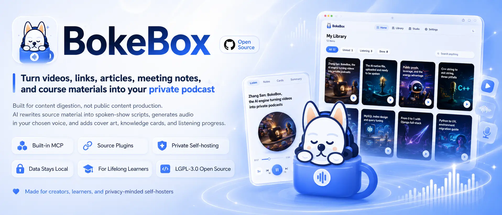
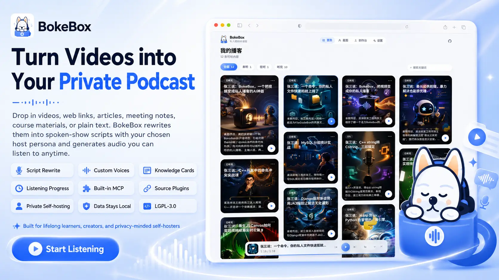
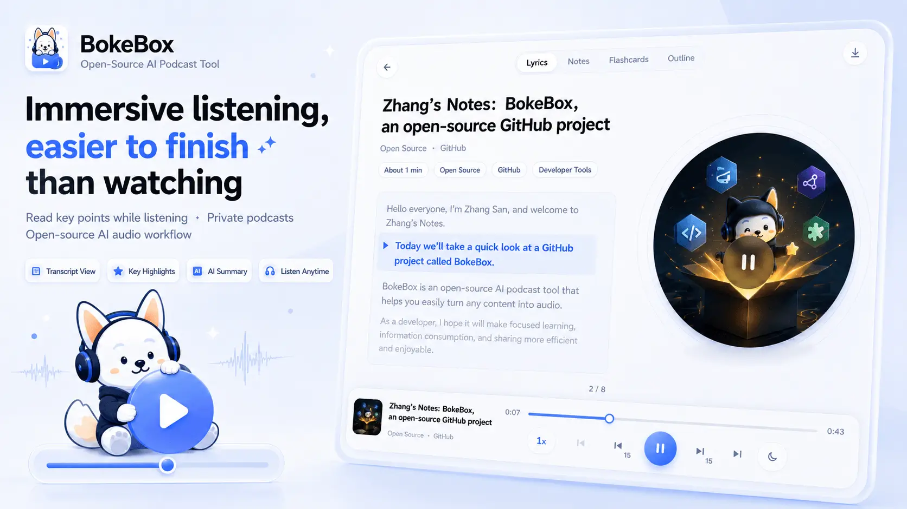

<p align="center">
  
</p>

<h1 align="center">BokeBox</h1>

<p align="center">
  <b>Content in. Private podcasts out.</b><br/>
  <sub>Turn videos, links, articles, meetings, and courses into private podcasts you can actually finish — host persona, voice, and style, all yours.</sub>
</p>

<p align="center">
  <b>English</b> · <a href="./README.zh-CN.md">简体中文</a>
</p>

<p align="center">
  <a href="https://github.com/vastsa/BokeBox/"></a>
  <a href="#-30-second-pitch"></a>
  <a href="#-problems-it-solves"></a>
  <a href="LICENSE"></a>
</p>

<p align="center">
  <a href="#-30-second-pitch">Product</a> ·
  <a href="#-who-its-for">Who it's for</a> ·
  <a href="#-ui-glimpse">UI</a> ·
  <a href="#-get-started">Get started</a>
</p>

<p align="center">
  
</p>

---

## 🎧 Sound familiar?

- You saved talks, courses, meeting notes, and long articles — always “later”
- On commutes, chores, or walks, you want to digest info — but your phone only offers short-video noise
- You want a show **just for yourself**, without recording into a mic at midnight
- You tried AI podcast demos: fake voices, rigid personas, and you quit after two minutes

**BokeBox is built for those moments.**

**Not limited to long videos.** Drop a video, web link, article, meeting note, course material, or plain draft into the box (and extend more sources via Source plugins). It will:

1. Understand the content  
2. Rewrite it as a spoken script  
3. Speak it in the voice you choose  
4. Turn it into a private podcast you can play anytime  

---

## ⚡ 30-second pitch

```text
  What you put in                    What BokeBox gives back
 ─────────────────                  ──────────────────────
  Meetings / notes                   Rhythmic spoken episodes
  Course replays / materials ─AI──▶  Custom host personas
  Long-form articles / drafts        Preset / described voices
  Any link (plugin-extensible)       Cover · flashcards · progress
```

**In one line:**  
Not another single-format “media-to-audio” converter — a **multi-source personal AI podcast studio that belongs only to you**.

---

## ✨ Why star it

| What you care about | How BokeBox does it |
| --- | --- |
| **You can actually finish it** | Not dry subtitle reading — AI rewrites into spoken structure: open, highlights, close |
| **Multi-source input** | Videos / links / drafts / meetings & courses — extend further with Source plugins |
| **Sounds like a person talking** | Natural podcast voices + delivery tags (pauses, light laughs, pace shifts…) |
| **You own the persona** | Who the host is, who they talk to, style, show name — global defaults or per-episode |
| **AI-native control** | Built-in MCP so Cursor / Claude can create episodes and query jobs |
| **Knowledge sticks** | Auto-extracted flashcards so key points are easy to review |
| **Your data stays yours** | Single-user private deploy; tasks and progress stay local — no public social feed |

If you believe:

> Great content deserves a second listen — told the way *you* like.

Give BokeBox a ⭐ and help more people discover private AI podcasts.

---

## 🎯 Problems it solves

### From “never finished reading/watching” to “easy to listen through”

Long videos, articles, meetings, and course materials are dense, but they burn **eye time** and **uninterrupted blocks**.  
BokeBox turns them into **ear time**: commute, chores, bedtime — still productive.

### From “robot reading a script” to “a show with a persona”

You can set:

- How the host introduces themselves  
- PM, teacher, or friend-chat vibe  
- Show name, tone, opening/closing habits  
- Which voice to use (or describe the timbre you want)

**AI generates. You direct taste and style.**

### From “heard and forgotten” to “take flashcards with you”

Each episode ships audio plus knowledge cards and notes — one listen becomes reviewable assets.

---

## 👤 Who it's for

- **Lifelong learners**: too many courses, interviews, keynotes, and essays — want highlights in spare time  
- **Creators / researchers**: digest multi-source material by ear before writing or editing  
- **Solo founders / indie hackers**: fold meetings, links, notes, and essays into one personal “info radio”  
- **Privacy-minded users**: content stays on your machine, not platform algorithms  

Not a fit if you want a public podcast platform, multi-tenant SaaS, or live collaborative editing. BokeBox is intentionally small, private, and deep.

---

## 🖼 UI glimpse

Create, listen, and manage task assets in one private space.

| Home | Player |
| :---: | :---: |
|  |  |

You get:

- **Home library** — finished shows and in-progress jobs at a glance  
- **One-click create** — upload video / paste link / drop draft, set persona & voice  
- **Task detail** — transcript, script, audio, cover, flashcards end-to-end  
- **Immersive player** — progress memory, speed, sleep timer  

---

## 🪄 How it feels

1. **Drop it in**  
   Local video, web link, article, or existing draft / notes — plus plugin-extended sources.

2. **Tune it (optional)**  
   Keep global persona, or set this episode’s tone.

3. **Go do something else**  
   Transcribe → script → voice → cover / cards — runs in the background.

4. **Put headphones on**  
   Open the player. Feels like a show made for you.

---

## 🔌 MCP (AI-native control)

BokeBox ships with a built-in **MCP (Model Context Protocol)** endpoint. After setup, the server **auto-issues a long-lived token**.

- Protocol: `POST /mcp` (Bearer token)
- Install payload: `GET /api/mcp/install` (login required), or **Settings → MCP**
- Tools include: `create_podcast_from_url`, `create_podcast_from_text`, `list_jobs`, `get_job`, …

Cursor example:

```json
{
  "mcpServers": {
    "bokebox": {
      "url": "http://localhost:8787/mcp",
      "headers": {
        "Authorization": "Bearer <token from Settings → MCP>"
      }
    }
  }
}
```

Optional env `PUBLIC_BASE_URL` helps generate the correct install URL behind a reverse proxy.

## 🚀 Get started

> Three steps to ship. Deeper deploy & model notes are in the appendix.

```bash
git clone https://github.com/vastsa/BokeBox.git
cd bokebox
cp .env.example .env   # add your API keys
./start.sh             # open http://localhost:5173
```

First launch walks you through **account setup** and model config.  
After that, your first private episode is one piece of content away.

**Docker (recommended: pull prebuilt image):**

```bash
cp .env.example .env
docker pull ghcr.io/vastsa/bokebox:latest
./start.sh docker
# open http://localhost:8787
```

**Docker (build from source locally):**

```bash
cp .env.example .env
./start.sh docker.local
```

---

## 💬 One-liner (shareable)

> BokeBox: turn videos, links, articles, meetings, and courses into private podcasts you’ll actually listen to. AI spoken scripts, custom persona & voice, MCP + pluggable sources, data stays on your machine.

If that resonates:

1. ⭐ **Star** the repo so more people see it  
2. Open an Issue — what content do you most want “podcast-ified”?  
3. PRs welcome — UX, copy, more voices & model adapters especially  

---

## 🛤 Roadmap vibes

- Better multi-episode / “continue listening” flows  
- Richer voices and providers  
- Subscription export (e.g. RSS) into apps you already use  
- Lighter one-click desktop packaging  

Your stars, issues, and PRs are roadmap votes.

---

## ❤️ Closing note

Most tools help you **produce content faster**.  
BokeBox cares more about helping you **digest content better**.

In an age of overload, what you can finish listening to is what truly becomes yours.

**Content in. Private podcasts out.**  
Add BokeBox to your toolkit — and drop a Star so more people find it.

---

<details>
<summary><b>Appendix: for people who want to deploy</b></summary>

### Requirements

- Node.js ≥ 22.5 · pnpm 9.x  
- OpenAI-compatible API (Chat / ASR / TTS; image model optional)

### Common commands

| Command | Description |
| --- | --- |
| `./start.sh` | Local dev (web 5173 + API 8787) |
| `./start.sh prod` | Build and run on a single port |
| `./start.sh docker` | Pull `ghcr.io/vastsa/bokebox:latest` and start |
| `./start.sh docker.local` | Build from local Dockerfile and start |
| `./start.sh docker:down` | Stop containers |

### Config highlights (`.env`)

```bash
OPENAI_API_KEY=sk-your-key
OPENAI_BASE_URL=https://api.example.com/v1
OPENAI_CHAT_MODEL=mimo-v2.5
OPENAI_TRANSCRIBE_MODEL=mimo-v2.5-asr
OPENAI_TTS_MODEL=mimo-v2.5-tts
OPENAI_TTS_DEFAULT_VOICE=冰糖
```

Full variables: `.env.example`. CI/CD & image publish: [`docs/ci-cd.md`](docs/ci-cd.md).

### Pipeline (sketch)

```text
multi-source input (video / link / draft / plugins)
  → normalize → ASR/understanding → spoken script
  → parallel: cover / flashcards / TTS → library
```

### Stack (if you ask)

React · Vite · Fastify · SQLite · ffmpeg · pnpm monorepo

### License

[LGPL-3.0](LICENSE) — open source; derivative works of the library must remain LGPL-compatible.

</details>

---

<p align="center">
  <b>BokeBox</b><br/>
  <sub>Private AI podcast box · Open Source · LGPL-3.0</sub><br/>
  <sub><a href="https://github.com/vastsa/BokeBox/">github.com/vastsa/BokeBox</a></sub>
</p>

## Source Plugins

BokeBox is **not locked to one media type**. Beyond built-in video / link / draft paths, optional external Source plugins extend content ingestion (high-risk fetchers are not bundled by default).

- Drop plugins into `storage/plugins/source/`, rescan in Settings  
- Plugins normalize inputs into the same pipeline: spoken script → voice → cover / flashcards  
- Developer guide: [docs/source-plugin-development.md](./docs/source-plugin-development.md)
- Architecture notes: [docs/source-plugins.md](./docs/source-plugins.md)
- Example plugin: [examples/source-plugin-echo](./examples/source-plugin-echo)

