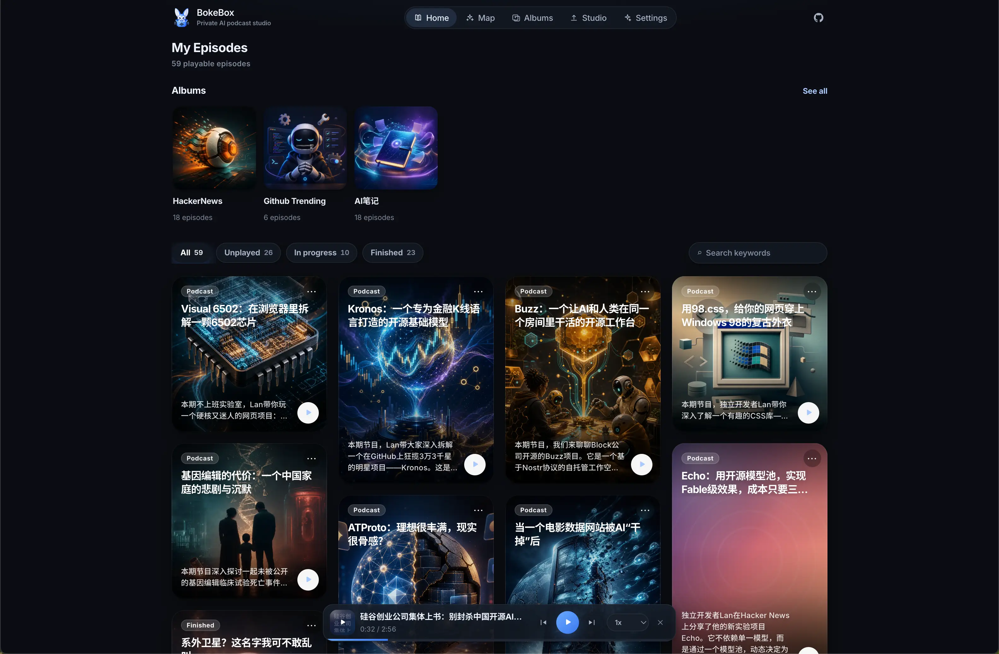
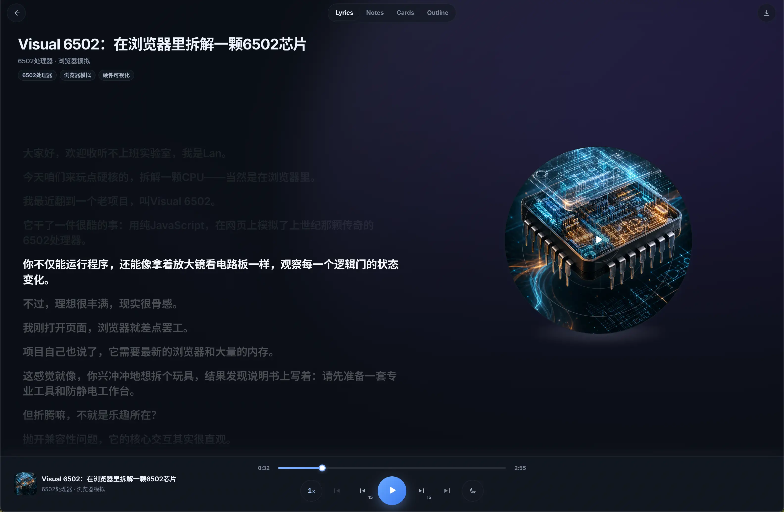
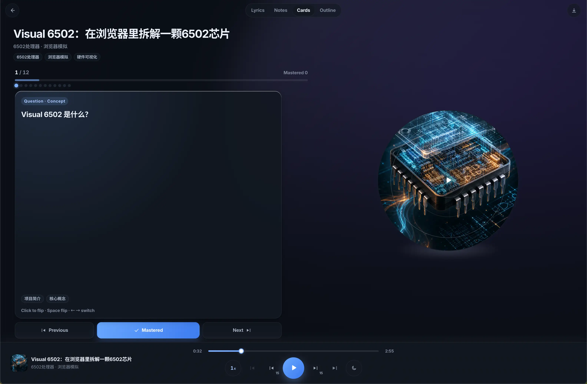
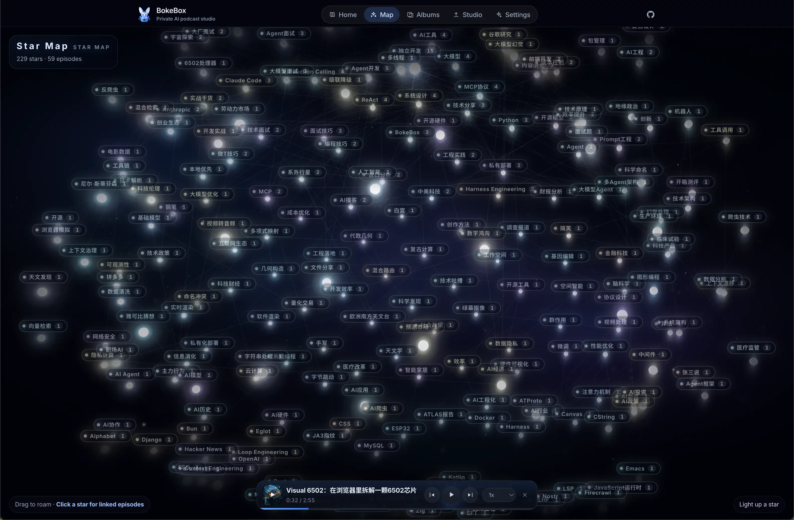
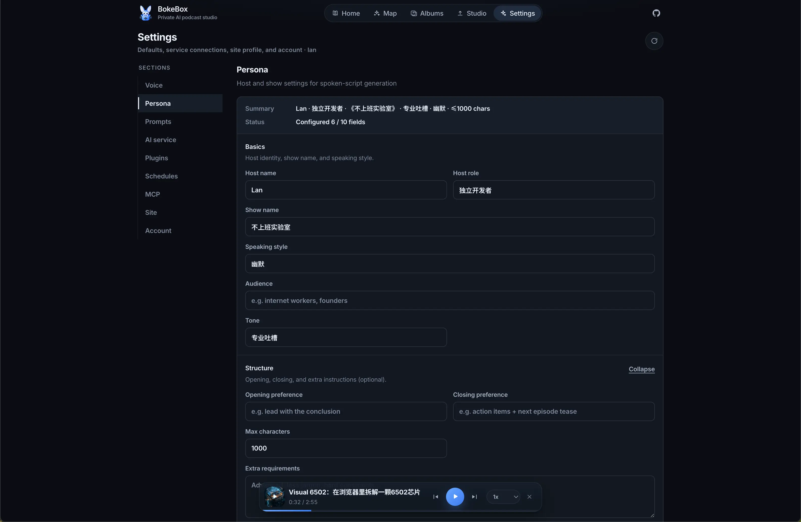
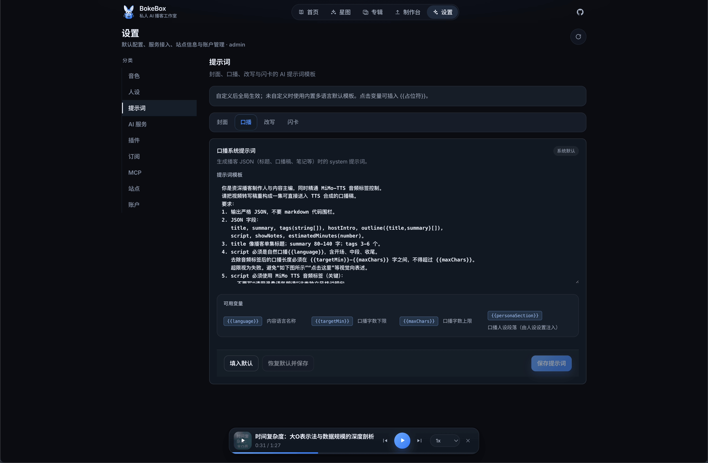
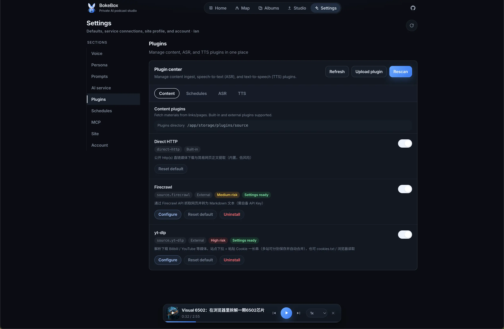
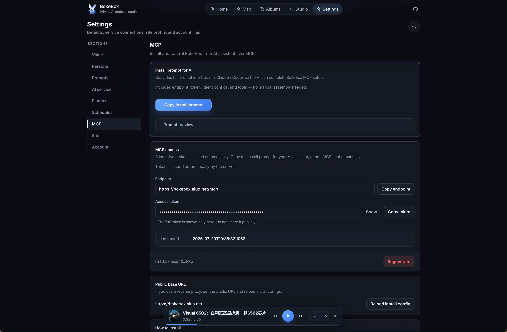
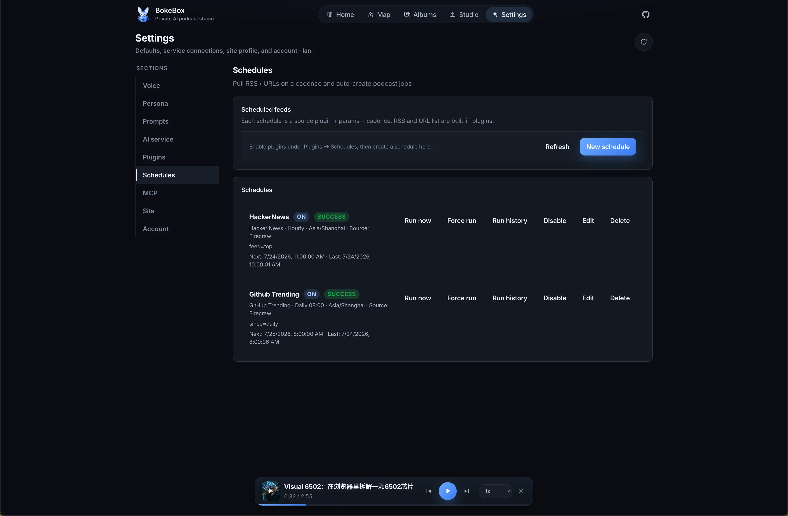
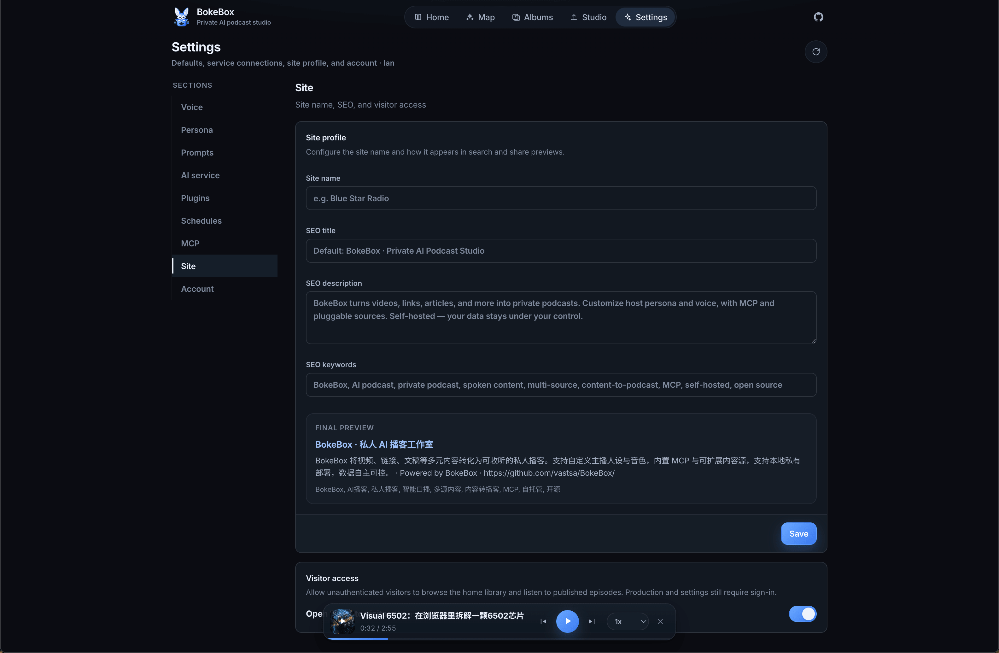

<p align="center">
  
</p>

<h1 align="center">BokeBox</h1>

<p align="center">
  <b>Content in. Private podcasts out.</b><br/>
  <sub>Turn multi-source content into private shows you can finish. Persona, voice, plugins, MCP — self-hosted.</sub>
</p>

<p align="center">
  <b>English</b> · <a href="./README.zh-CN.md">简体中文</a>
</p>

<p align="center">
  <a href="https://github.com/vastsa/BokeBox/"></a>
  <a href="https://bokebox.aiuo.net/"></a>
  <a href="https://bkb-docs.aiuo.net/"></a>
  <a href="LICENSE"></a>
  <a href="https://github.com/vastsa/BokeBox"></a>
</p>

<p align="center">
  <a href="https://www.producthunt.com/products/bokebox?embed=true&utm_source=badge-featured&utm_medium=badge&utm_campaign=badge-bokebox" target="_blank" rel="noopener noreferrer">
    
  </a>
</p>

<p align="center">
  <a href="https://bokebox.aiuo.net/">Demo</a> ·
  <a href="https://bkb-docs.aiuo.net/">Docs</a> ·
  <a href="https://www.producthunt.com/products/bokebox">Product Hunt</a> ·
  <a href="#get-started">Get started</a> ·
  <a href="#ui">UI</a> ·
  <a href="#feature-map">Features</a>
</p>

<p align="center">
  
</p>

---

## Bottom line first

**BokeBox turns “I’ll read/watch it later” into private episodes you can actually finish — and keep.**

| You put in | You get back |
| --- | --- |
| Video / links / drafts / meetings & courses | Spoken episode + cover + flashcards + progress |
| Global or per-episode persona / voice | Feels like a show made for you |
| Plugins / MCP / schedules | Extensible inputs, AI-native control |

**One line**: a self-hosted private AI podcast studio — your data stays local, the pipeline is pluggable, listening quality beats feature bloat.

**Try it now**

- Demo: <https://bokebox.aiuo.net>
- Docs: <https://bkb-docs.aiuo.net>
- Local in three steps:

```bash
git clone https://github.com/vastsa/BokeBox.git
cd bokebox
cp .env.example .env   # add API keys
./start.sh             # http://localhost:5173
```

Docker (recommended prebuilt image):

```bash
cp .env.example .env
docker pull ghcr.io/vastsa/bokebox:latest
./start.sh docker      # http://localhost:8787
```

---

## 30-second pitch

```text
  What you put in                    What BokeBox gives back
  ─────────────────                  ──────────────────────
  Meetings / notes                   Rhythmic spoken episodes
  Long reads / talks / courses       Host persona + natural voice
  Any link (plugin-extensible)       Cover · flashcards · progress
```

1. **Drop it in** — video, link, draft, or plugin sources  
2. **Tune optionally** — persona, voice, prompts  
3. **Let it run** — ASR → spoken script → TTS → cover / cards  
4. **Listen** — player + albums + star map + review

---

## Why it matters

| Pain | What BokeBox does |
| --- | --- |
| Endless “read later” | Moves content into ear time |
| Robot read-aloud | Rewrites into spoken structure with persona |
| Heard and forgotten | Auto flashcards for key points |
| Locked-in inputs | Source / ASR / TTS / Schedule plugins |
| Cloud lock-in | Single-user self-host; jobs & media stay local |

Good fit: knowledge workers, commute listeners, private “shows for myself”, privacy-minded self-hosters.  
Not a fit: public podcast platforms, multi-tenant SaaS, live collaborative editing.

---

## UI

Create, listen, and manage assets in one private space.

| Home | Player |
| :---: | :---: |
|  |  |
| **Flashcards** | **Star Map** |
|  |  |

### Settings

| Persona | Prompts |
| :---: | :---: |
|  |  |
| **Plugins** | **MCP** |
|  |  |
| **Schedules** | **Site** |
|  |  |

---

## Feature map

<details>
<summary><b>Expand full checklist (pipeline / listening / plugins / MCP / deploy)</b></summary>

### Multi-source input
- Local upload: video / audio / draft
- URL import: article body, public media links
- Pin a Source plugin or auto-match; assign album, persona, voice on create

### AI production pipeline
- Extract → ASR → spoken script → cover / notes / flashcards → TTS
- Async jobs with home progress; re-run from a chosen step and skip finished stages
- Publish to library, retry failures, delete jobs

### Persona · voice · prompts
- Global host persona + per-episode override
- Preset voices + text-described voice design
- Prompt hub: cover / spoken / rewrite / flashcards with `{{placeholders}}`
- Content language: global default or per job

### Assets & listening
- Job detail: transcript, script, notes, flashcards, cover, audio
- Player: progress memory, speed, sleep timer (incl. end of episode)
- Albums for continuous play; Star Map by tags

### Settings center
- **Voice / Persona / Prompts / AI service / Plugins / Schedules / MCP / Site / Account**
- Account: UI language + theme (system / light / dark)

### Schedules
- Schedule plugins discover candidates; Source plugins fetch/parse
- Built-ins: RSS, URL list, GitHub Trending, Hacker News, …
- Dedup, rate limits, run now / force, run history  
- Guide: [docs/guide/schedule.md](./docs/guide/schedule.md)

### Plugins
- Shared Source / ASR / TTS / Schedule contracts; rescan / zip upload / enable in Settings  
- Docs & examples: [docs/plugins/](./docs/plugins/) · [docs/development/](./docs/development/) · [examples/](./examples/)

### MCP (AI-native control)
- Built-in `POST /mcp` with auto long-lived token
- Copy Cursor / Claude / Codex install configs from Settings
- Tools include `create_podcast_from_url` / `create_podcast_from_text` / `list_jobs` / `get_job` / schedule tools, …
- Optional `PUBLIC_BASE_URL` for reverse-proxy install URLs

Cursor example:

```json
{
  "mcpServers": {
    "bokebox": {
      "url": "http://localhost:8787/mcp",
      "headers": {
        "Authorization": "Bearer <token from Settings>"
      }
    }
  }
}
```

### Deploy & privacy
- `./start.sh` dev · `./start.sh prod` single port · Docker prebuilt / local / China mirrors
- Single-user self-host: SQLite + local storage
- License: **LGPL-3.0** · repo: https://github.com/vastsa/BokeBox

</details>

---

## Get started

> Prefer clicking first? [Demo](https://bokebox.aiuo.net) · details in [docs](https://bkb-docs.aiuo.net)

```bash
git clone https://github.com/vastsa/BokeBox.git
cd bokebox
cp .env.example .env   # add your API keys
./start.sh             # http://localhost:5173
```

First launch walks through account setup and model config.

| Mode | Command | Open |
| --- | --- | --- |
| Local dev | `./start.sh` | `http://localhost:5173` |
| Single-port prod | `./start.sh prod` | see script output |
| Docker prebuilt | `docker pull ghcr.io/vastsa/bokebox:latest && ./start.sh docker` | `http://localhost:8787` |
| Docker local build | `./start.sh docker.local` | `http://localhost:8787` |
| China mirrors build | `./start.sh docker.cn` | `http://localhost:8787` |

---

## Docs & links

| Entry | URL |
| --- | --- |
| Online docs (EN/ZH) | <https://bkb-docs.aiuo.net> |
| Demo | <https://bokebox.aiuo.net> |
| In-repo docs | `docs/` (VitePress) |
| Plugins / developer guides | [docs/plugins/](./docs/plugins/) · [docs/development/](./docs/development/) |
| CI / images | [docs/ops/ci-cd.md](./docs/ops/ci-cd.md) |

```bash
pnpm docs:dev
pnpm docs:build
pnpm docs:preview
```

---

## Roadmap & contribute

- Better multi-episode / continue-listening flows  
- Richer voices and providers  
- Subscription export (e.g. RSS) into apps you already use  
- Lighter one-click desktop packaging  

If that resonates:

1. ⭐ **Star** the repo  
2. Open an Issue — what should be “podcast-ified”?  
3. PRs welcome — UX, copy, voices & model adapters especially  

> **Shareable one-liner**: BokeBox turns videos, links, articles, meetings, and courses into private podcasts. Customize persona and voice, with MCP and pluggable sources. Self-hosted — your data stays under your control.

**Content in. Private podcasts out.** Most tools help you produce content faster; BokeBox helps you digest it better.

---

<details>
<summary><b>Appendix: requirements · commands · config · stack</b></summary>

### Requirements
- Node.js ≥ 22.5 · pnpm 9.x
- OpenAI-compatible API (Chat / ASR / TTS; image model optional)

### Common commands

| Command | Description |
| --- | --- |
| `./start.sh` | Local dev (web 5173 + API 8787) |
| `./start.sh prod` | Build and run on a single port |
| `./start.sh docker` | Pull `ghcr.io/vastsa/bokebox:latest` and start |
| `./start.sh docker.local` | Build from local Dockerfile and start |
| `./start.sh docker.cn` | Build with China mirrors and start |
| `./start.sh docker:down` | Stop containers |

### Config highlights (`.env`)

```bash
OPENAI_API_KEY=sk-your-key
OPENAI_BASE_URL=https://api.example.com/v1
OPENAI_CHAT_MODEL=mimo-v2.5
OPENAI_TRANSCRIBE_MODEL=mimo-v2.5-asr
OPENAI_TTS_MODEL=mimo-v2.5-tts
OPENAI_TTS_DEFAULT_VOICE=冰糖
```

Full variables: `.env.example`.

### Pipeline (sketch)

```text
multi-source input (video / link / draft / plugins)
  → normalize → ASR/understanding → spoken script
  → parallel: cover / flashcards / TTS → library
```

### Stack
React · Vite · Fastify · SQLite · ffmpeg · pnpm monorepo

### License
[LGPL-3.0](LICENSE) — open source; derivative works of the library must remain LGPL-compatible. Repo: https://github.com/vastsa/BokeBox

</details>

---

<p align="center">
  <b>BokeBox</b><br/>
  <sub>Private AI podcast box · Open Source · LGPL-3.0</sub><br/>
  <sub><a href="https://github.com/vastsa/BokeBox/">github.com/vastsa/BokeBox</a></sub>
</p>
