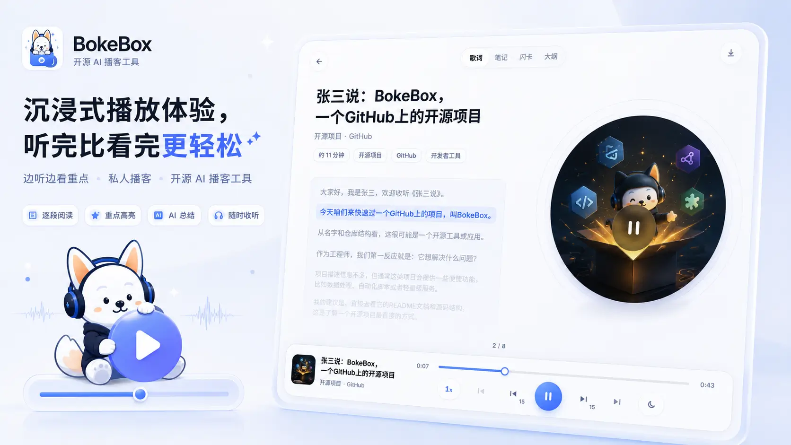
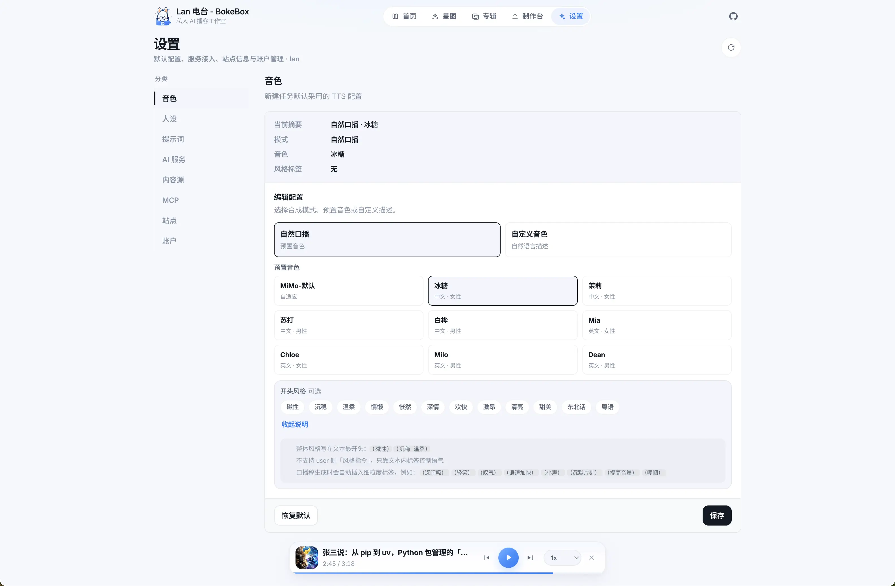
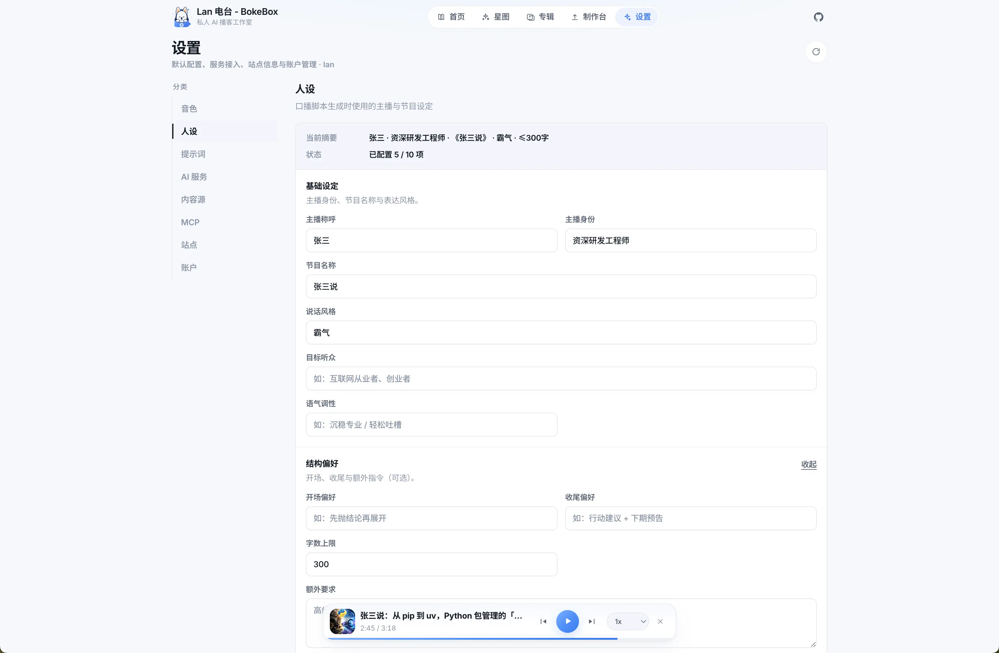
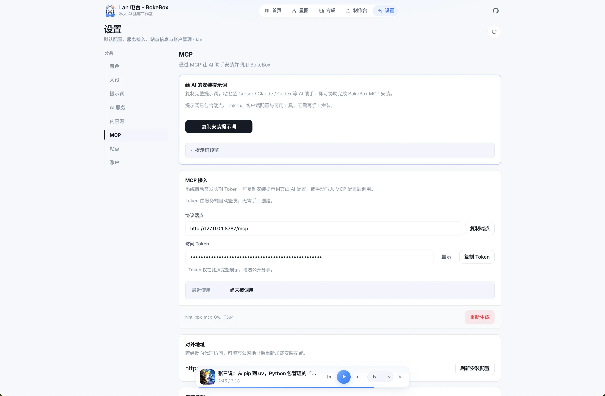
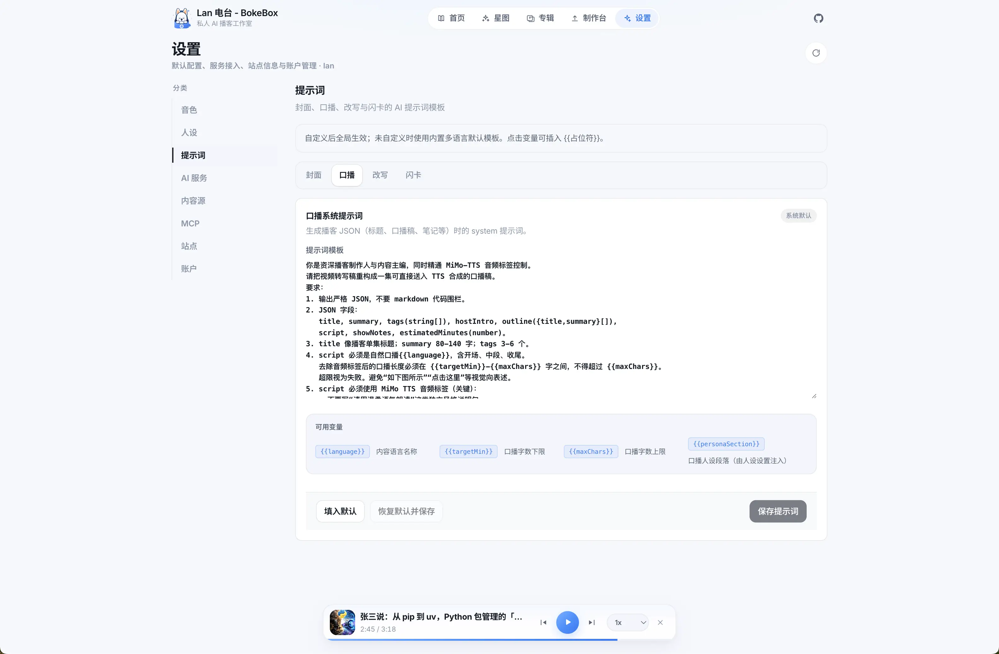
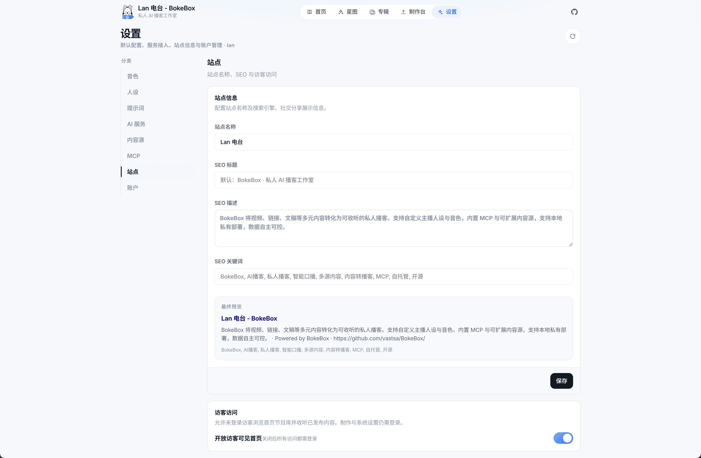
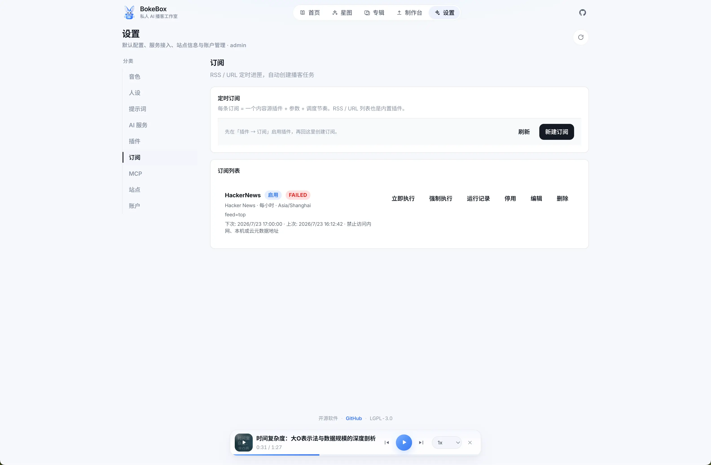

<p align="center">
  
</p>

<h1 align="center">BokeBox · 播匣</h1>

<p align="center">
  <b>内容进匣，AI 成播</b><br/>
  <sub>将视频、链接、文稿、会议与课程等多源内容，转化为可收听的私人播客 —— 人设、音色与风格均可自定义</sub>
</p>

<p align="center">
  <a href="./README.md">English</a> · <b>简体中文</b>
</p>

<p align="center">
  <a href="https://github.com/vastsa/BokeBox/"></a>
  <a href="https://bokebox.aiuo.net/"></a>
  <a href="https://bkb-docs.aiuo.net/"></a>
  <a href="LICENSE"></a>
  <a href="https://github.com/vastsa/BokeBox"></a>
</p>

<p align="center">
  <a href="https://bokebox.aiuo.net/">演示站</a> ·
  <a href="https://bkb-docs.aiuo.net/">在线文档</a> ·
  <a href="#-30-秒看懂">了解产品</a> ·
  <a href="#-功能清单">功能清单</a> ·
  <a href="#-谁适合用">适合谁</a> ·
  <a href="#-界面一览">界面</a> ·
  <a href="#-开始使用">开始使用</a>
</p>

<p align="center">
  
</p>

---

## 🎧 你是不是也有过这些时刻？

- 收藏了技术分享、课程、会议纪要、长文，**永远「稍后处理」**
- 通勤、洗碗、散步时想消化信息，手机里却只有短视频噪音
- 想做一档「只给自己听」的节目，又不想对着麦克风录到深夜
- 听过 AI 播客 demo，结果声音假、人设死板，听两分钟就关掉

**BokeBox 就是为这些时刻准备的。**

**不限于长视频。** 把视频、网页链接、文章、会议纪要、课程材料或纯文稿丢进匣子（也可用 Source 插件扩展更多内容源），它会帮你：

1. 理解内容  
2. 写成口播稿  
3. 用你指定的声音说出来  
4. 变成一档随时可听的私人播客  

---

## ⚡ 30 秒看懂

```text
  你丢进去的                    BokeBox 交还给你的
 ─────────────                 ─────────────────
  会议录像 / 纪要               有节奏的口播节目
  课程回放 / 材料    ──AI──▶    可自定义的主播人设
  深度长文 / 文稿               预置 / 描述定制音色
  任意链接（可插件扩展）         封面 · 闪卡 · 听播进度
```

**一句话：**  
不是又一个「某格式转音频」工具，而是一台 **多源输入、只属于你的 AI 播客工作室**。

---

## ✨ 为什么值得 Star

| 你在意的 | BokeBox 怎么做 |
| --- | --- |
| **真的能听完** | 不是干巴巴朗读字幕，而是 AI 重写为口播结构：有开场、有重点、有收尾 |
| **输入不设限** | 视频 / 链接 / 文稿 / 会议与课程等都能进；Source 插件继续扩展内容源 |
| **听起来像「有人在讲」** | 支持自然口播音色 + 语气标签（停顿、轻笑、语速变化……） |
| **人设你说了算** | 主播是谁、对谁讲、什么风格、节目叫什么 —— 全局默认或单集临时改 |
| **AI 可直接调用** | 内置 MCP，Cursor / Claude 等可创建节目、查询任务 |
| **知识不会听完就忘** | 自动提炼知识闪卡，方便回看重点 |
| **数据在你自己手里** | 单用户私有部署，任务与进度落本地，不做公域内容社交 |

如果你也相信：

> 好内容值得被「听」第二次，而且应该用你喜欢的方式被讲述。

那就给 BokeBox 一个 ⭐ 吧 —— 让更多人看见「私人 AI 播客」这件事。

---

## 🎯 它解决什么问题

### 从「看不完 / 读不完」到「听得进」

长视频、长文、会议与课程材料信息密度高，但占用的是「眼睛时间」和「整块时间」。  
BokeBox 把它们改造成「耳朵时间」：通勤、家务、睡前，都能消化。

### 从「机器念稿」到「有人设的节目」

你可以设定：

- 主播怎么称呼自己  
- 像产品经理、老师，还是朋友聊天  
- 节目名、语气调性、开场收尾习惯  
- 用哪一副声音说话（或用文字描述出你想要的音色）

**AI 负责生成，你负责审美与风格。**

### 从「听过就忘」到「带走闪卡」

每期不只给你音频，还会整理知识闪卡与节目笔记，让一耳朵内容变成可复习资产。

---

## 👤 谁适合用

- **终身学习者**：课程、访谈、发布会、长文太多，只想用碎片时间听重点  
- **创作者 / 研究者**：先把多源素材听消化，再决定写什么、剪什么  
- **一人公司 / 独立开发者**：把周会、链接、笔记、长文统一收成自己的「信息广播」  
- **注重隐私的人**：内容不出自己的机器，不为平台算法打工  

不适合：想做公域播客平台、多租户 SaaS、或纯在线协作编辑的团队（BokeBox 刻意做小、做私、做深）。

---

## 🖼 界面一览

制作、听播、任务资产，都在同一个私有空间里完成。

| 首页 | 播放页 |
| :---: | :---: |
|  |  |

你将拥有：

- **首页播客库** —— 做好的节目与进行中的任务一眼可见  
- **一键制作页** —— 上传视频 / 粘贴链接 / 投入文稿，顺手配好人设与音色  
- **任务详情** —— 转写、脚本、音频、封面、闪卡全链路可回看  
- **沉浸播放器** —— 进度记忆、倍速、睡眠定时，听感完整  

---

## ⚙️ 设置中心

音色、人设、提示词、MCP、站点与订阅，统一在一个设置中心里完成。

| 音色 | 人设 |
| :---: | :---: |
|  |  |
| **MCP** | **提示词模板** |
|  |  |
| **站点** | **订阅** |
|  |  |

---

## 🪄 使用体感

1. **丢进去**  
   本地视频、网页链接、文章，或已有文稿 / 纪要；也可用插件扩展内容源。

2. **设一下（可选）**  
   沿用你的全局人设，或给这一集单独定调。

3. **去忙别的**  
   转写 → 写稿 → 配音 → 封面 / 闪卡，后台自动跑完。

4. **戴上耳机**  
   打开播放页，像听一档真正为你制作的节目。

---

## 📋 功能清单

按产品能力整理的当前功能全景（与设置中心、任务详情、听播库一致）。

### 多源输入
- 本地上传：视频 / 音频 / 文稿
- URL 导入：网页正文抽取、公开视频 / 音频直链
- 创建时可指定 Source 插件，或自动匹配
- 创建时可归入专辑、选择人设与音色

### AI 制作流水线
- 音频提取 → 转写（ASR）→ 口播脚本 → 封面 / 笔记 / 闪卡 → TTS 合成
- 后台异步任务，首页可见进度与状态
- 可从指定步骤重跑（提取 / 转写 / 脚本 / 封面 / 闪卡 / 合成），跳过已完成步骤
- 支持上架到听播库、重试失败任务、删除任务

### 人设 · 音色 · 提示词
- 全局主播人设与单集临时人设
- 预置音色 + 文字描述定制音色（Voice Design）
- 提示词模板中心：封面 / 口播 / 改写 / 闪卡，支持变量占位符
- 内容语言可全局默认，也可按任务单独指定

### 节目资产
- 任务详情可回看：原转写、口播脚本、节目笔记、知识闪卡、封面、音频
- AI 封面生成（可自定义封面提示词）
- 知识闪卡独立生成 / 重新生成，支持主动回忆复习
- 标签与节目摘要，首页 / 星图可浏览

### 听播体验
- 沉浸播放器：进度记忆、倍速、睡眠定时（含「播完本集」）
- 专辑：创建 / 整理 / 专辑内连续收听
- 星图标签浏览，按主题回到相关节目
- 听播库与制作任务同空间管理

### 设置中心
- **音色**：新建任务默认 TTS 配置
- **人设**：口播脚本默认主播与节目设定
- **提示词**：封面 / 口播 / 改写 / 闪卡模板
- **AI 服务**：接口凭证、模型参数、提供方选择
- **插件**：内容获取 / 定时订阅 / ASR / TTS 统一管理（扫描、启用、上传 zip、参数配置）
- **订阅**：RSS / 榜单 / 自定义源定时进匣并自动成播
- **MCP**：Token、安装配置、可用工具
- **站点**：站点名称、SEO、访客访问
- **账户**：界面语言、亮/暗主题、密码与开源信息


### 定时订阅
- 设置 → 订阅：按节奏自动拉取内容并创建播客任务
- 统一模型：内容源插件 + 参数 + cron（时区可配）
- 内置源：RSS/Atom、URL 列表、GitHub Trending、Hacker News
- 去重限流：仅新条目、每轮条数上限；支持立即执行 / 强制执行
- 运行记录可回看；失败条目可下轮重试
- 外部订阅插件：`storage/plugins/schedule/`，可 zip 上传（见 [docs/development/schedule-plugin.md](./docs/development/schedule-plugin.md)）
- MCP：`list_schedules` / `create_schedule` / `run_schedule_now` / `list_schedule_plugins`

### 插件体系
- **Source 插件**：扩展内容获取方式（内置 direct-http；外部插件目录 `storage/plugins/source/`）
- **ASR / TTS 插件**：可切换内置与外部提供方，插件参数独立配置
- 设置页支持重新扫描、上传安装、卸载外部插件
- 文档与示例：
  - [docs/plugins/source.md](./docs/plugins/source.md)
  - [docs/development/source-plugin.md](./docs/development/source-plugin.md)
  - [docs/plugins/asr-tts.md](./docs/plugins/asr-tts.md)
  - [docs/development/tts-plugin.md](./docs/development/tts-plugin.md)
  - [examples/source-plugin-echo](./examples/source-plugin-echo)
  - [examples/tts-plugin-echo](./examples/tts-plugin-echo) · [examples/tts-plugin-fishspeech](./examples/tts-plugin-fishspeech)

### MCP（AI 直接调用）
- 内置 MCP 端点，服务端自动签发长期 Token
- 设置页一键复制 Cursor / Claude Desktop / Codex 安装配置
- 可用工具：
  - `create_podcast_from_url` / `create_podcast_from_text`
  - `list_jobs` / `get_job` / `update_job` / `retry_job` / `delete_job`
  - `list_library` / `get_system_health`

### 部署与私有化
- 本地一键启动：`./start.sh`（开发）/ `./start.sh prod`（单端口）
- Docker：预构建镜像 / 本地构建 / 国内镜像源构建
- 单用户私有部署，任务、进度与媒体落本地（SQLite + 本地存储）
- 开源协议：LGPL-3.0 · 仓库：https://github.com/vastsa/BokeBox

---

## 🔌 MCP（AI 直接调用）

BokeBox 内置 **MCP（Model Context Protocol）** 端点，服务启动后会在后台 **自动生成长期 Token**。

- 协议端点：`POST /mcp`（Bearer Token）
- 安装配置：登录后 `GET /api/mcp/install`（或在 **设置 → MCP** 复制）
- 常用工具：`create_podcast_from_url` / `create_podcast_from_text` / `list_jobs` / `get_job` …

Cursor 示例配置：

```json
{
  "mcpServers": {
    "bokebox": {
      "url": "http://localhost:8787/mcp",
      "headers": {
        "Authorization": "Bearer <在设置页复制的 Token>"
      }
    }
  }
}
```

可选环境变量 `PUBLIC_BASE_URL`：当经反向代理暴露时，用于生成正确的安装地址。


## 📚 文档站

- **在线文档**：<https://bkb-docs.aiuo.net>  （中 / 英切换）
- **演示站**：<https://bokebox.aiuo.net>  （可体验的在线实例，数据与密钥请勿当真用）
- 源码内文档：仓库 `docs/`，由 **VitePress** 维护

```bash
pnpm docs:dev      # 本地预览
pnpm docs:build    # 构建静态站
pnpm docs:preview  # 预览构建产物
```

文档结构：入门（开始 / 第一期 / FAQ）· 使用（流水线 / 订阅 / MCP）· 部署与架构 · 插件 · 开发 · 运维。  
兼容旧路径：`docs/*.md` 仍可从 README 跳转至新页面。


## 🔌 内容源插件

BokeBox **不把输入锁死在某一种媒体上**。除内置的视频 / 链接 / 文稿路径外，还可通过外部 Source 插件扩展内容获取方式（默认不捆绑高风险抓取）。

- 插件放进 `storage/plugins/source/`，设置页扫描启用即可  
- 统一产出素材后，仍走同一套管线：口播稿 → 音色 → 封面 / 闪卡  
- 开发规范： [docs/development/source-plugin.md](./docs/development/source-plugin.md)
- 系统说明： [docs/plugins/source.md](./docs/plugins/source.md)
- 示例插件： [examples/source-plugin-echo](./examples/source-plugin-echo)
- ASR/TTS 插件说明： [docs/plugins/asr-tts.md](./docs/plugins/asr-tts.md)
- TTS 插件开发： [docs/development/tts-plugin.md](./docs/development/tts-plugin.md)
- TTS 示例： [examples/tts-plugin-echo](./examples/tts-plugin-echo) · [examples/tts-plugin-fishspeech](./examples/tts-plugin-fishspeech)
- 前端 Token（字号/颜色）： [docs/development/web-design-tokens.md](./docs/development/web-design-tokens.md)

## 🚀 开始使用

> 想先点一点？打开演示站：<https://bokebox.aiuo.net>  
> 部署与配置细节见 [在线文档](https://bkb-docs.aiuo.net) 或下方「附录」。

> 三步开箱（本地 / Docker）：

```bash
git clone https://github.com/vastsa/BokeBox.git
cd bokebox
cp .env.example .env   # 填入你的 API Key
./start.sh             # 打开 http://localhost:5173
```

首次进入会引导你完成 **账号初始化** 与模型配置。  
之后，你的第一期私人播客，只差一条内容。

**Docker（推荐：拉取预构建镜像）：**

```bash
cp .env.example .env
docker pull ghcr.io/vastsa/bokebox:latest
./start.sh docker
# 访问 http://localhost:8787
```

**Docker（本地源码构建）：**

```bash
cp .env.example .env
./start.sh docker.local
```

**Docker（国内镜像构建，推荐大陆服务器）：**

```bash
cp .env.example .env
./start.sh docker.cn
# 使用 DaoCloud Node 镜像 + 阿里云 apt + npmmirror
# 系统安装 ffmpeg，避免 GitHub 下载超时
```

---

## 💬 一句话安利（可转发）

> BokeBox（播匣）：将视频、链接、文稿、会议与课程等多源内容，转化为可收听的私人播客。支持自定义主播人设与音色，内置 MCP 与插件式内容源，本地私有部署，数据自主可控。

如果这个方向戳中你：

1. ⭐ **Star** 本仓库，让更多人看见  
2. 提交 Issue，说说你最想听「哪种内容被播客化」  
3. PR 欢迎 —— 尤其是体验、文案、更多声音与模型适配  

---

## 🛤 我们想把匣子装得更好

- 更自然的多集节目与「续听」体验  
- 更丰富的音色与提供方选择  
- 订阅导出（例如 RSS），接到你已有的听播软件  
- 桌面端更轻的一键封装  

你的 Star、Issue 和 PR，就是路线图的投票。

---

## ❤️ 写在最后

大多数工具在帮你「更快地生产内容」。  
BokeBox 更在意帮你 **更好地消化内容**。

在信息过载的时代，能被你听完的，才算真正属于你。

**内容进匣，AI 成播。**  
欢迎把 BokeBox 收进你的工具箱 —— 并点一颗 Star，让这件事被更多人看见。

---

<details>
<summary><b>附录：给想动手部署的你</b></summary>

### 环境

- Node.js ≥ 22.5 · pnpm 9.x  
- 可用的 OpenAI 兼容 API（Chat / ASR / TTS，图片模型可选）

### 常用命令

| 命令 | 说明 |
| --- | --- |
| `./start.sh` | 本地开发（前端 5173 + 后端 8787） |
| `./start.sh prod` | 构建后单端口运行 |
| `./start.sh docker` | 拉取 `ghcr.io/vastsa/bokebox:latest` 并启动 |
| `./start.sh docker.local` | 本地 Dockerfile 构建并启动 |
| `./start.sh docker.cn` | 国内镜像源构建并启动（推荐大陆服务器） |
| `./start.sh docker:down` | 停止容器 |

### 配置要点（`.env`）

```bash
OPENAI_API_KEY=sk-your-key
OPENAI_BASE_URL=https://api.example.com/v1
OPENAI_CHAT_MODEL=mimo-v2.5
OPENAI_TRANSCRIBE_MODEL=mimo-v2.5-asr
OPENAI_TTS_MODEL=mimo-v2.5-tts
OPENAI_TTS_DEFAULT_VOICE=冰糖
```

完整变量见 `.env.example`。CI/CD 与镜像发布见 [`docs/ops/ci-cd.md`](docs/ops/ci-cd.md)。Web 字号/颜色 Token 规范见 [`docs/development/web-design-tokens.md`](docs/development/web-design-tokens.md)。

### 流水线（简图）

```text
多源输入（视频 / 链接 / 文稿 / 插件源）
  → 归一素材 → ASR/理解 → 总结口播稿
  → 并行：封面 / 闪卡 / TTS → 听播库
```

### 技术栈（不重要，但有人问）

React · Vite · Fastify · SQLite · ffmpeg · pnpm monorepo

### License

[LGPL-3.0](LICENSE) —— 开源协议；基于本项目库代码的衍生修改需保持 LGPL 兼容。

</details>

---

<p align="center">
  <b>BokeBox</b><br/>
  <sub>私人 AI 播客工作室 · 开源 · LGPL-3.0</sub><br/>
  <sub><a href="https://github.com/vastsa/BokeBox/">github.com/vastsa/BokeBox</a></sub>
</p>
